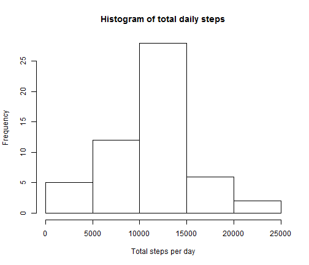
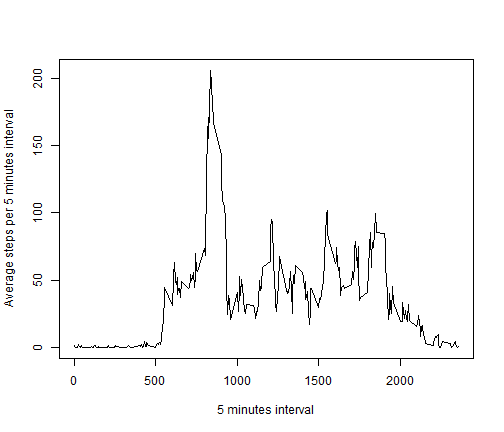
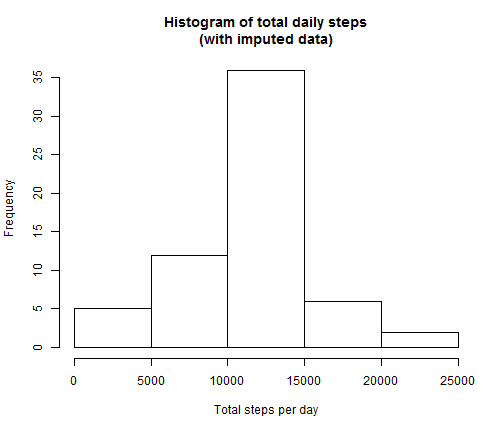
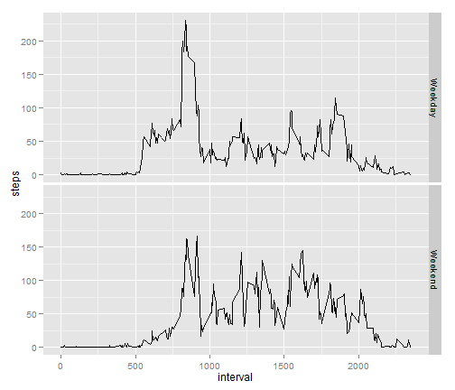

Reproducible Research: Peer Assessment 1
========================================================
This assignment is part of Coursera online course "Reproducible Research". It's the first peer assessment in this course. This markdown document with the embedded code is written by: Mohamed Sabry Bakry - 15th of June 2014.

The assignment consists of 5 parts, as following:

## Loading and preprocessing the data

This chunk of code will load data into an object called "mydata":

```r
mydata <- read.csv(unz("activity.zip", "activity.csv"))
```

## What is mean total number of steps taken per day?
We will then use tapply to get the total number of steps taken each day

```r
daily_dat <- tapply(mydata$steps, mydata$date, sum)
```


The following histogram shows the distribution of total number of steps taken each day:

```r
hist(daily_dat, main = "Histogram of total daily steps", xlab = "Total steps per day")
```

 

The mean of total number of steps taken per day is:

```r
mean(daily_dat, na.rm = T)
```

```
## [1] 10766
```

 while the median is: 

```r
median(daily_dat, na.rm = T)
```

```
## [1] 10765
```

It should be noted that missing values are not yet imputed in this step so far.


## What is the average daily activity pattern?

Now we will use tapply again to create a new data frame containing the average number of steps taken in each recorded 5-minutes time interval (pooled over all days)

```r
intervals_dat <- tapply(mydata$steps, mydata$interval, mean, na.rm = T)
```


The following time series plot shows the average steps taken during each 5 mnutes time interval, averaged over all days:

```r
plot(dimnames(intervals_dat)[[1]], intervals_dat, type = "l", xlab = "5 minutes interval", 
    ylab = "Average steps per 5 minutes interval")
```

 


The following 5-minutes time interval, on average across all the days in the dataset, contains the maximum number of steps:

```r
names(intervals_dat[intervals_dat == max(intervals_dat)])
```

```
## [1] "835"
```


## Imputing missing values

It should be noted that the dataset already contains missing values. The total number of missing values in this dataset is:

```r
sum(is.na(mydata$steps))
```

```
## [1] 2304
```

So, we will use the mean number of steps in each 5-minutes time interval to substitute missing values (impute missing values), and create a new dataset called mydata2 with the imputed values (no missing values). In order to perform this imputation we will loop through all rows of missing values, get the interval of this row, and use the mean of this interval (from the previously created dataset called "intervals_dat") to impute the missing value.

```r
mydata2 <- mydata
for (i in which(is.na(mydata$steps))) {
    mydata2[i, ]$steps <- intervals_dat[as.character(mydata2[i, ]$interval)]
}
```


Now we can re-examine the distribution of steps taken daily as we did before, but this time with the imputed dataset.

We will then use tapply again to get the total number of steps taken each day, from the imputed dataset:

```r
daily_dat_imp <- tapply(mydata2$steps, mydata2$date, sum)
```


The following histogram shows the distribution of total number of steps taken each day from the imptuted dataset:

```r
hist(daily_dat_imp, main = "Histogram of total daily steps\n(with imputed data)", 
    xlab = "Total steps per day")
```

 

The mean of total number of steps taken per day for the imputed dataset is:

```r
mean(daily_dat_imp, na.rm = T)
```

```
## [1] 10766
```

 while the median for the imputed dataset is: 

```r
median(daily_dat_imp, na.rm = T)
```

```
## [1] 10766
```

Although imputation did not largely affect the distribution of data as noted above, but the total number of steps taken is increased and few previously missing days are now added to the dataset.

## Are there differences in activity patterns between weekdays and weekends?

In order to examine whether there is a difference in activity patterns between weekdays and weekends, we first need to add new variable called "weekday" to indicate whether the date was a weekend or a normal weekday. We will use the function "strptime" to convert the date from string format to date format, then we will use the function "weekdays" to get the day of this date, finally we will recode those days into either "weekend" or "weekday" and convert that variable to a factor.

```r
mydata2$day <- weekdays(strptime((mydata)$date, "%Y-%m-%d"))
mydata2$weekday <- ifelse(mydata2$day %in% c("Saturday", "Sunday"), "Weekend", 
    "Weekday")
mydata2$weekday <- as.factor(mydata2$weekday)
```


The following chunk of code uses the package "reshape2" to prepare the dataset (by melting it) for proper plotting to show difference between average steps taken during weekends or weekdays:

```r
library(reshape2)
finaldat <- melt(tapply(mydata2$steps, list(mydata2$interval, mydata2$weekday), 
    mean))
colnames(finaldat) <- c("interval", "day", "steps")
```


The following plot shows two panels: The upper one shows the average number of steps taken during each 5-minutes time interval pooled over weekdays only, while the lower panel shows the average number of steps taken during each 5-minutes time interval pooled over weekends.
The package ggplot2 is used for plotting:

```r
library(ggplot2)
qplot(interval, steps, data = finaldat, facets = day ~ ., geom = "line")
```

 

